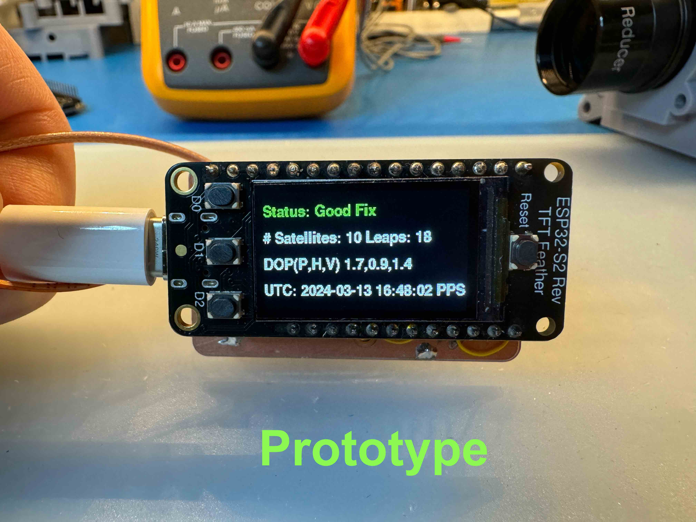
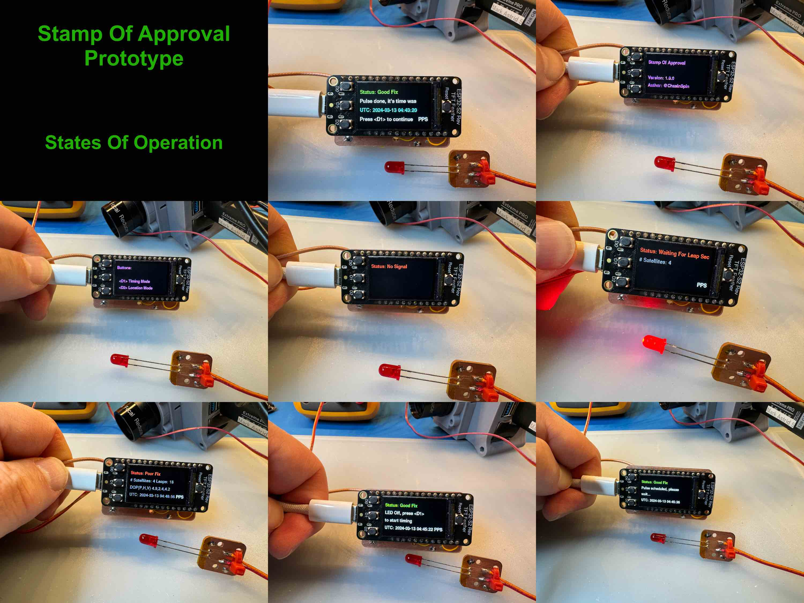
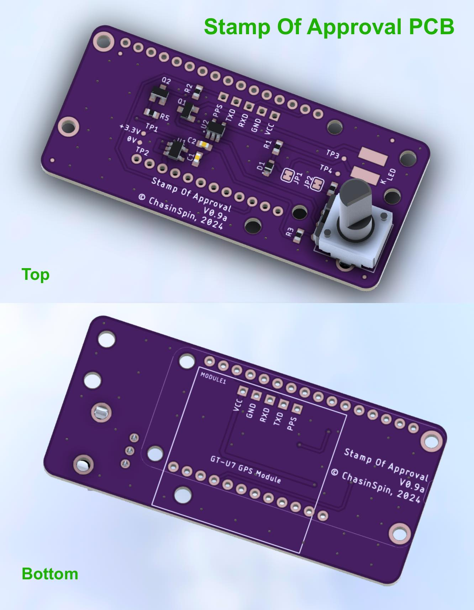
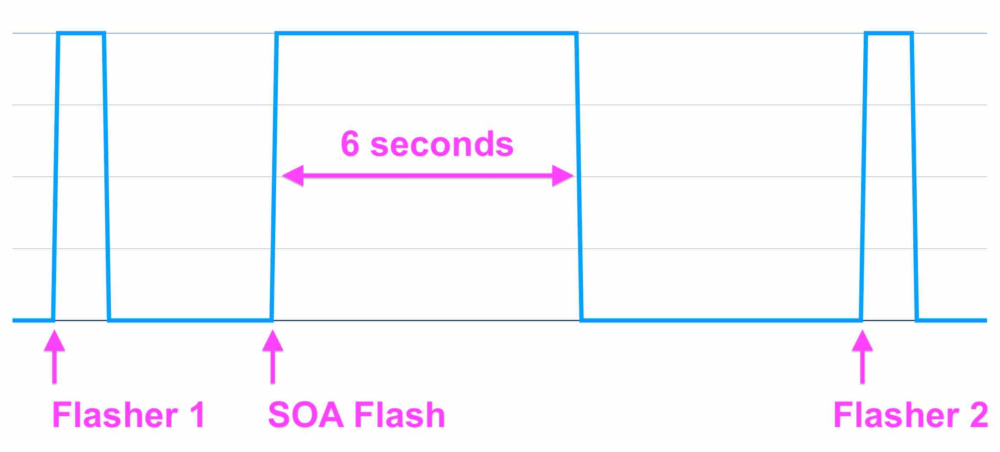
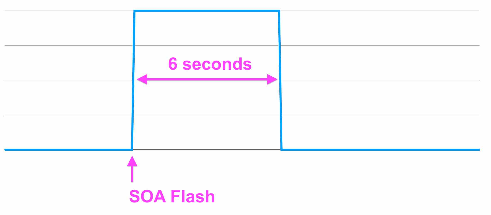
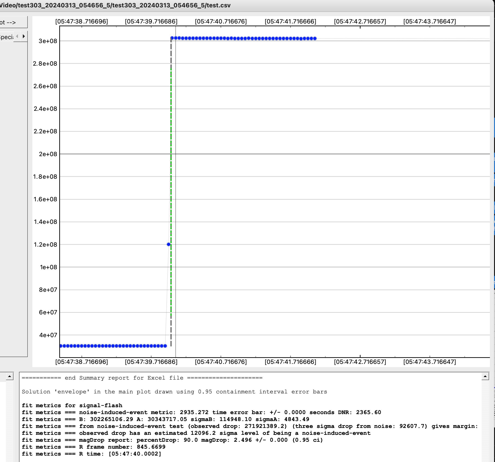

# Stamp Of Approval

* [Introduction](#introduction)
* [Features](#features)
* [Purpose](#purpose)
* [Design Goals](#design-goals)
* [Buttons](#buttons)
* [Timing Pulse Mode](#timing-pulse-mode)
* [Flasher](#flasher)
* [LED Driver](#led-driver)
* [Power](#power)
* [Acquisition Requirements](#acquisition-requirements)
* [Leap Seconds](#leap-seconds)
* [TFT Time Display Accuracy](#tft-time-display-accuracy)
* [Poor GPS Signal](#poor-GPS-Signal)
* [Forcing GPS Cold Restart](#forcing-gps-cold-restart)
* [Analyzing Timing](#analyzing-timing)
* [States](#atates)
* [WWV Testing](#wwv-testing)
* [Assembled Version](#assembled-version)
* [BOM Bill Of Materials](#bom-bill-of-materials)
* [Construction](#construction)
* [Installing](#installing)
* [Reset to factory defaults](#reset-to-factory-defaults)
* [Specifications](#specifications)
* [Developer Notes](#developer-notes)
* [Release Notes](#release-notes)

## Introduction

Stamp Of Approval (SOA) is a highly accurate timing device to verify Occultation Transit Eclipse (OTE) timing.  Accurate and repeatable time is critical for OTE events. SOA is used to test the timestamping accuracy on frames from cameras and occultation flashers through to the OTE application to provide a level of confidence in the timing for the devices and processes involved. It can also double up as a basic programmable flasher device.

SOA consists of a microcontroller with a display, a GPS receiver with Pulse Per Second (PPS) output, and an LED flasher. To verify timing, a flash on the LED is generated, which should be fed to your acquisition system and timed with software like [pymovie](https://github.com/bob-anderson-ok/pymovie) or [py-ote](https://github.com/bob-anderson-ok/py-ote).

Note:

	Using flasher-type devices for occultations adds extra 
	complexity and possibility for user error in the acquisition/analysis
	process.  It also often calls into question the observer's timing 
	which can be dependent on the flasher device/code used, who 
	built it etc.
		
	A better solution is to use Astrid as a complete acquisition 
	system (which also includes the computer/camera/frame timing/
	plate solving/prepoint).

		
## Features

* **240x135 Color TFT Display + buttons**
* **User Error proof**
	* *No information is provided if the GPS signal is not adequate, green = OK, red = BAD e.g. traffic light*
* **Validates your complete timing**
	* *e.g. flashers, VTI, [Astrid](https://github.com/ChasinSpin/astrid)), your processes and analysis*
* **Highly accurate timing**
	* *at 30fps result is accurate to 0.0001s or less after analysis in Py-OTE*
* **Hardware Gated Timing**
	* *The LED pulse comes directly from the GPS and is not dependent on Input Capture Registers or Interrupts in software.  This results in close to zero hardware delay between the GPS issuing the timing pulse and the LED flashing - 53 nanoseconds (other Flashers issue the LED pulse themselves from software, resulting in delays and possible race/non-deterministic behavior).*
* **10-second pulse alignment aligned on 00, 10, 20, 30, 40, 50 seconds UTC**
	* *1-second pulses are difficult to check time against by other means (a clock can be wrong), however, an error of 10 seconds is very easy to spot*
* **Leap seconds dealt with correctly**
	* *No leap seconds = no time output... simple*
* **Doubles up as a basic regular flasher**
* **Accurate Latitude / Longitude / Altitude**
* **Monitors and notifies for signal issues**
	* *Number of Satellites, Fix, Dilution of Precision, PPS Drops*
* **Analog Adjustable LED Brightness**
	* *No PWM delays*
	* *No need to program brightness*	 
	* *Full range*
* **Constant Current and Regulated LED Driver**
	* *Flatter pulses for more accurate timing*
	* *Immunity to brightness drops due to CPU processing which impacts timing*
* **External antenna for better GPS signal**
* **Open source**
* **Specifications sheet with accuracy detailed**

## Purpose

SOA is intended to verify timing from start to finish, i.e., the time of a calculated "Flash" in PyOTE or other D/R timing analysis software is the end goal, and it's the result should be evaluated. If the time is incorrect, then the cause needs to be determined.

However, SOA only verifies the time at the point in time the test is run.  It is quite possible (and likely in some circumstances) that poorly written software/firmware or clock synchronization in your acquisition system or flasher may result in a system that appears to behave well at some points in time and provides incorrect timing at other points in time.

## Design Goals

SOA is designed to keep the output as close to the raw GPS output as possible to reduce the risk of software issues impacting timing.  Additionally, the LED flasher signal is taken directly from the GPS receiver so that there is no impact on timing from any of the usual processing delays inherent to microcontrollers.

SOA does not allow the user to think they have good timing when they do not, it's designed according to the traffic light principle, such that if "Status" is Green, then you can have confidence in the timing.  If it is any other color (typically Red), then you should not rely on the timing and should improve your GPS Signal.

Typical code optimization methods, i.e., anything that makes the code more difficult to understand/analyze by another party, have been avoided.  The code is written in Python (specifically Circuit Python) for a larger audience.  Due to the above approach, it's possible to use Python without compromising the timing.

## Buttons

SOA has 2 modes, and to switch between modes, you press the <D1> button:

* Monitoring: This is the default and will be used until a good fix is acquired; the LED flasher flashes every second. This should not be used to check your timing.
* Timing Pulse: The LED-flasher flashes on a 10-second mark, e.g., 10:32:20 UTC. 

The <D2> button is used to toggle between displaying satellite signal status and position/altitude.

## Timing Pulse Mode

Timing pulse mode is used to verify your timing. At least a blank 4-second period is provided on either side of the flash, and the time of the flash is provided. Your camera/acquisition/OTE Software captures and analyzes this flash, and the timing accuracy of your system can be determined. The appearance time of the flash in your OTE Software should match the time provided by SOA. The duration of the pulse is 6 seconds.

If you are using a flasher, too, as part of your acquisition system, you will need to align your time in your OTE Software using those flashes first, prior to determining the time on your SOA LED-flasher pulse.

Button <D1> is used to initiate the Timing Pulse blanking period and subsequently pressed to initiate the pulse. Button <D2> is used to toggle the location display.

## Flasher

It's possible to operate SOA as a basic programmable and highly accurate flasher, although that is not the design goal. There are better solutions than flashers. For example, [Astrid](https://github.com/ChasinSpin/astrid) would be a preferred solution, and if you absolutely have to use a flasher, then IOTA-GFT (coming soon) is a well-designed flasher too.

Flasher behavior is kept very simple in SOA and requires a Good Signal for the flash to occur.  It's bare bones; all it does is flash the LED at the times you choose, as detailed below.  There's no extra fluff like countdowns etc.  However, it does that with very high accuracy as it uses the same hardware gating of the GPS signal and is more accurate than other flasher solutions.

It is suggested that you issue multiple flashes before and after the event just in case one of the flashes is not successful due to poor signal quality. SOA (for reasons of complexity reduction) does not maintain its own timebase in the event that the signal is lost.

To use SOA as a flasher, create a plain text file on your PC called: flasher.txt

Inside, put the UTC times you wish the flashes to occur, one per line, and in HH:MM:SS format aligned on 10-second UTC boundaries (00, 10, 20, 30, 40, 50 seconds), for example:

	05:08:10
	05:09:10
	05:10:10
	05:12:00
	05:13:00
	05:14:00
	
**IMPORTANT: Be aware that each flash is 6 seconds long, remember to factor that in such that your observation isn't impacted by the flash.**

Connect SOA via USB to your computer, and copy the flasher.txt into the CIRCUITPY drive.  

SOA will restart shortly and read the flasher.txt file.  If this read is successful and the file is correctly formatted, then it will enter "Flasher" mode and display the first 4 times to indicate the flasher.txt file has been successfully read.  If the file is empty or contains errors, then an error message will be displayed instead.

In flasher mode, the LED will flash at the times specified with 6-second pulses aligned with the LED coming on at the time of the PPS pulse from the GPS.

To return to regular operation (non-flasher), then remove the flasher.txt file.

If you need to tune the brightness of the LED to avoid saturation with your camera, then press button <D1> to enter 1-second pulse mode (this pulses for 0.9s on and 0.1s off). You will need to press <D1> again to return to flasher mode before the event.

The <D2> button will toggle between the signal quality display and Latitude/Longitude/Altitude display.

Unlike [Astrid](https://github.com/ChasinSpin/astrid), SOA does not maintain an audit trail for its flasher functionality, it is advisable to monitor SOA visually during acquisition.

## Power

SOA must be powered via the microcontroller's USB-C port, not the JST battery port or the GPS USB port.

To power via the USB-C port, either connect to a computer or power via a USB PowerBank. Any USB cable to the computer needs to be both power and data-capable. 

## LED Driver

The LED driver design in SOA uses an adjustable brightness, regulated analog-driven constant current design that does not overdrive the LED, use voltage drive, or PWM.

This has some advantages over regular designs, which leads to more accurate timing in your OTE software:

* No variable PWM mid-cycle delays
* No dropouts in brightness due to processor activity/load
* Flatter start to the pulse 

## Acquisition Requirements

It's critical that the LED flasher signal on your camera/acquisition system is not saturated. If it is, then the signal cannot be interpolated to get accurate timing by the OTE Software, as information has been lost due to clipping of the signal (saturation). However, to get the maximum signal-to-noise ratio and, therefore, accuracy in time, you should adjust the LED flasher output so that it fills most of the camera's range.

It's also important that there is no artificial light ingress into the optical train to your camera.  For example, most electrical items that emit light will either be running at 60/50Hz or be Pulse Width Modulated (PWM) which means that the light source is switching on and off fast (beyond the ability of your eye to register), however, this can result in artifacts in camera frames, where intensities are not correct, leading to timing problems when interpolated.

Generally, it is advised to insert the LED into the light path of the telescope or via a light-tight tube to the camera if on a bench. A lens to bring an image to focus can also be used; however, because the light is focused, there likely will be saturation.

## Leap Seconds

SOA refuses to provide a time when it's not aware of the Leap Seconds downloaded from the GPS Almanac.  This awareness can come from an Alamanc download (every 12.5 minutes via GPS) or from a previous almanac download stored via battery backup and non-volatile memory on the GPS receiver.

As SOA won't provide a time without knowing the leap seconds, there is ordinarily no requirement to be concerned with Leap Seconds. The exception to this is if there has been a leap second change since you last used SOA and you are within 12.5 minutes of getting that initial time. In this situation, the time may be offset. Such cases are extremely rare, but you can check the current number of leap seconds or wait 12.5 minutes for the Alamanac update.

## TFT Time Display Accuracy

VERY IMPORTANT: To test timing accurately, you MUST use the LED flasher, not the TFT Time Display.

SOA is only accurate for the LED flasher, which aligns with the start of a second.  The TFT Display on SOA (which displays the time) always updates after the start of the second, but before the next and is typically late by about 270ms.  Therefore it shouldn't be used for timing other than approximately to within 0.3s.  It has been purposely designed this way so that the code associated is minimal and thus provides minimally processed output from the GPS.

## Poor GPS Signal

Possible reasons are:

* Antenna upside down (black part not pointing to the sky)
* Usage inside (the top floor of a house may work depending on construction, but outside is better)
* Obstructed view of the sky (trees, buildings, etc.), GPS requires a clear 360-degree view of the sky
* Placed on metal. Although the antennas are magnetic, the metal often creates a ground plane and can make reception unpredictable; avoid metal other than a nail or a bolt
* Placed on the ground. Ground is an unpredictable ground plane; often, grass/dirt interferes with the signal, and a concrete slab may not, experience varies, avoid.
* Attached to a telescope.  Telescopes move and are often metal both of which will interfere with signal reception
* Poor cable connection.  Ensure the antenna cable is fully screwed in and the antenna hasn't disconnected from the GPS receiver
* Broken antenna

## Forcing GPS Cold Restart

A cold restart is when the Almanac/Time/Satellite Ephemeris and all State Information are deleted from the GPS forcing it to be downloaded again.  A GPS cold started will take longer to provide position and time.

To force SOA to cold start place an empty file called coldstart.txt on the CIRCUITPY drive when connected to a computer, then eject the drive from the computer. SOA will then auto restart, send the cold start instruction to the GPS and delete the coldstart.txt file so that on the next boot, the GPS will return to normal warm start behavior.

## Analyzing Timing

Pymovie/Py-OTE is used as an example here. If you are using other OTE software, please provide information on how to use it so that it can be added to this documentation.

The device you are testing (Device Under Test = DUT) can either be a Flasher or an acquisition system that times frames directly or by computer.

### DUT = Flasher

With a DUT=Flasher device, you ordinarily correct your timing via the Calc Flash, etc. method in Py-OTE using a Flash Aperture. This means you bracket your recording with at least a flash on either side. As you are doing this already, it is assumed that you know how to do this.

However, the SOA flash should be in the middle, so you want three flashes:

	DUTFlash -> SOA Flash -> DUTFlash.

### DUT = Other (e.g., [Astrid](https://github.com/ChasinSpin/astrid), IOTA-VTI, etc.)

These devices don't need to have their timing corrected (although IOTA-VTI needs to have OCR applied to its timing; again, you'll know how to do this).

Only one flash is required, the SOA Flash.

### Analyzing the SOA Flash

To time the SOA Flash, you need to time ONLY the rising edge of the SOA Flash (the trailing edge will always be less accurate due to the physics of LEDs).

To do this, first, create a Flash Aperture in Pymovie and analyze the video as normal. Then, in Py-OTE, trim the waveform so only the rising (R edge or Reappearance edge) is left. (If the D edge or anything else is present, it won't work.)

Then mark the R edge as normal, and click on Find Event to get the timing of the R edge.

It's important to ensure that you have at least 12 or more frames before and after the rising edge so that Py-OTE can determine an accurate answer.

## States

SOA has the following states, and follows the traffic light principle, Red, Amber, Green with the addition of a magenta for unknown:

| State/Msg | Description | Reports | Color |
| --------- | ----------- | ------- | ----- |
| No GPS | No communication with GPS | - | Magenta |
| No Signal | GPS is running, but no satellites acquired yet | - | Red |
| Acquiring (no PPS) | GPS has at least one satellite but not enough to provide PPS  | #satellites | Red |
| Waiting For Leap Seconds | GPS has PPS but is waiting for leap seconds via the Almanac | #satellites | Red|
| Poor Fix | GPS has PPS and time, but fails quality checks (HDOP, VDOP, #Satellites, 3D Fix) | UTC, HDOP, VDOP, Satellites and PPS | Red |
| Good Fix | GPS has PPS and time and passes quality checks (HDOP, VDOP, #Satellites, 3D Fix) | UTC, HDOP, VDOP, Satellites and PPS | Green |
| Timing Pulse | Displays the UTC time the 6-second timing pulse was started (the LED came on) | Time of Pulse | Green |

## WWV Testing

SOA has had the edge sense of the PPS pulse checked by extending the pulse duration to 600ms and comparing by audio against the WWV radio signal.  Note that this isn't to confirm a precise time.  However, it does confirm that the rising edge of the pulse matches the time markers on WWV and that the GPS isn't providing the sync on the falling edge (as the UBlox documentation in regard to this is ambiguous).  It also confirms the time provided as UTC is accurate to the second.

## Assembled Version

### Includes

* Stamp Of Authority:
	* Display
	* GPS Receiver
	* Case
* GPS Active Antenna
* LED on magnetic mount (with 1.5m wire)

### Purchase Required

USB-C Male to USB-A Male cable

**OR**

USB-C Male to USB-C Male 
cable

*cable must be power and data capable*

## BOM Bill Of Materials

| Quantity | Part | Value | Tolerance | Package | Description | Notes |
| -------- | ---- | ----- | --------- | -------- | ----------- | ----- |
| 1	 | R1 | 10 | 1% | 0603 | Resistor | |
| 1	 | R3 | 33K | 1% | 0603 | Resistor | |
| 1	 | R2 | 1K | 5% | 0603 | Resistor | |
| 1	 | R5 | 10K | 5% | 0603 | Resistor | |
| 1 | RP1 | 1K Log | - | Pot | PTV09A-4030F-A102 1K Log Potentiometer | |
| 1 | C2 | 0.1uF | 20 % X5R/X7R | 0603 | Capacitor | |
| 1 | C1 | 0.47uF | 20 % X5R/X7R | 0603 | Capacitor | |
| 1 | LED1 | WP7113SURDK | - | T1-3/4 5mm | LED | Do not substitute |
| 2 | Q1, Q2 | MMBT3904LT1G | - | SOT23 | Transistor | Do not substitute |
| 1 | U1 | MIC5203-3.3YM5 | - | SOT23-5 | 3.3V Regulator | |
| 1 | U2 | MCP6486RT-E/OT | - | SOT23-5 | Rail to rail Op-amp | Do not substitute. Make sure it's the RT version, regular version has supply rails switched |
| 1 | - | PPPC121LFBN-RC | - | - | 12 Pin 0.1 Female Header | |
| 1 | - | PPPC161LFBN-RC | - | - | 16 Pin 0.1 Female Header | |
| 1 | MS1 | 5345 | - | Feather | Adafruit ESP32-S2 TFT Reverse | Do not substitute |
| 1 | MODULE1 | GT-U7 | - | GT-U7 | GT-U7 Ublox 6M Compatible GPS Receiver | Do not substitute |
| 1 | Antenna | BFN00457 | - | - | Bingu Waterproof Active GPS Navigation Antenna Adhesive Mount SMA Male GPS Antenna with 15cm 6inch U.FL IPX IPEX to SMA Female RG178 Coaxial Pigtail Cable for GPS Module Receiver Tracking | |
| 1 | CASE | - | - | - | Case & Buttons | |
| * TBD * | | | | | Nuts | |
| * TBD * | | | | | Bolts | |
| 2 | - | - | - | - | Small Zip Tie max 3mm width | |
| 1 | PCB | - | - | - | Main PCB | |
| 1 | PCB | - | - | - | LED Carrier PCB | |
| 1 | - | - | - | - | 1.5m Double Conductor Wire | |
| 1 | R4 | DNP | DNP | 0603 | Resistor | Do not populate |
| 1 | D1 | DNP | DNP | Diode | CUS08F30,H3F | Do not populate |

## Construction

SOA is provided completely assembled. Construction details coming soon.

## Installing

First installation:

* Connect SOA to computer via USB cable (data and power capable)
* Fast double-tap the reset button, then tap again 1 second later, SOA will enter bootloader mode and provide a Green/Blue/Orange Background
* Place the file: 
`circuitpython/adafruit-circuitpython-adafruit_feather_esp32s2_reverse_tft-en_US-8.2.9.uf2`
in the FTHRS2BOOT drive on the computer and wait for SOA to reboot
* Place all the files and folders found with the folder "soa" into the "CIRCUITPY" drive that appears on the computer and wait for SOA to start

For subsequent upgrades, you can start from the last item on the above list as Circuit Python is now already installed.

Note: More recent Macs may get a -36 error when copying files into SOA; this error can be ignored.

## Reset to factory defaults

Reference: [Factory Reset](https://learn.adafruit.com/esp32-s2-reverse-tft-feather/factory-reset)

To reset, power up with a USB cable connected to a computer, fast double-tap the reset button, and tap again a fraction of a second later (while purple). The Feather TFT screen should be displayed with a Green/Blue/Orange background.

Drag and drop 
`other/adafruit_feather_esp32s2_reversetft_factory_reset.uf2` onto FTHRS2BOOT drive and wait for reboot.

## Specifications

| Feature | Measurement |
| ------- | ----------- |
| Power Supply | USB-C Cable (power and data capable) - 5V |
| Power Usage | 100-170mA |
| GPS | GT-U7 Module (UBlox NEO-6M) |
| Display | 240x135 Color TFT |
| Buttons | 3 + Reset |
| Monitor Mode LED Pulse | 100ms on, 900ms off when acquired, rising edge on the second |
| Timing Mode LED Pulse | 6s on, 4s off when acquired, rising edge on a UTC 10-second boundary |
| Programming Language | Circuit Python V8 |
| LED Driver | Analog with Constant Current Adjustable Driver |
| GPS PPS to LED output delay (op-amp) | < 53ns |
| GPS Accuracy | 2.35ns over 6 hours with sampling deviation of 6.7ns |
| LED Current Range | 33.4uA - 9.5mA |
| Pulse brightness decay @ 9.5mA LED Current over 1 second | 0.227% (~0.0001s timing error in Py-OTE @ 33fps) |
| Pulse brightness decay @ 1.8mA LED Current over 1 second | 0.073% (~0.0000s timing error in Py_OTE @ 33fps)|

## Developer Notes

[https://github.com/todbot/circuitpython-tricks?tab=readme-ov-file](https://github.com/todbot/circuitpython-tricks?tab=readme-ov-file)

## Release Notes

### Version 1.0.0

Initial version
